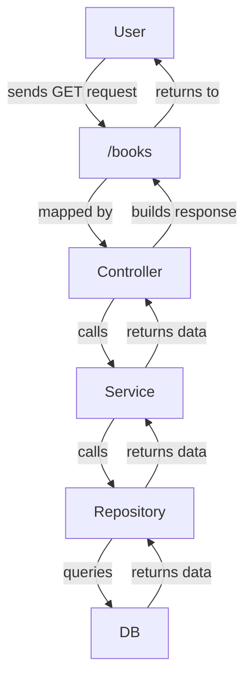

# CFG Java Masters Project

Group project for the CFG Java Masters

## Project Description

A backend application built with Java and Spring Boot that uses REST APIs and a MySQL database.
This project manages a bookstore's inventory and transactions, including purchases.

------

## Features

- View all books in the Book Store
- Add a new book to the store
- Purchase a book
- Refund a book
- OpenAPI

------

## Software Requirements

To run this project you will need:

- **Java 21 or higher, Spring Boot**
- **IDE (IntelliJ IDEA)**
- **MySQL database integration with JPA**
- **RESTful API with OpenAPI documentation**
- **Unit testing using JUnit and Mockito**

------

## Getting Started

### Installation

```bash
git clone https://github.com/nade-t/cfg-java-masters-project.git
```

```bash
cd cfg-java-masters-project
```

------

## Configuration

The app is configured using application.yml

1. Locate the `application.yml.example` in the resources directory.
2. Replace credentials with your own username and MySQL password

## Database Setup

Create your MySQL database and table using the .sql script included in the project:

- Location: `src/main/resources/database.sql`

## Run the Application

1. Make sure MySQL is running
2. Create the database using the .sql file
3. Update application.yml with DB credentials
4. Run the application: in IntelliJ run the main class

------

## API Endpoints

| Method | Endpoint             | Description                    |
|--------|----------------------|--------------------------------|
| GET    | /books               | Retrieves all books            |
| POST   | /books               | Adds a new book                |
| PATCH  | /books/{id}/purchase | Carries out purchase operation |
| PATCH  | /books/{id}/refund   | Refunds a purchase             |

------

## Architecture Overview

- Controllers handle HTTP requests
- Services contain business logic
- Repositories handle DB interactions


------

## Docker Deployment
This project includes Docker support for running the backend and MySQL as containers.

### Prerequisites

- Docker installed
- Docker Compose installed

### Steps to Run

1. From the project root directory, build the Docker image:
```bash
docker build -t cfg-java-masters-project
```
2. Run the application and database using Docker Compose:
```bash
docker-compose up
```
This will start:
- The Spring Boot application (on port 8080)
- A MySQL database container (on port 3306)

#### Files Included
- Dockerfile – Builds the Java Spring Boot application image.
- docker-compose.yml – Defines services and network for app and MySQL.
------

## Open API Documentation

1. Ensure the ProjectApplication is running and then access the url here: http://localhost:8080/swagger-ui/index.html
2. Expand the endpoint dropdowns
3. Click on the Try it out buttons and Execute

------

### Authors

- Violeta
- Nade
- Jessie
- Radhika  
