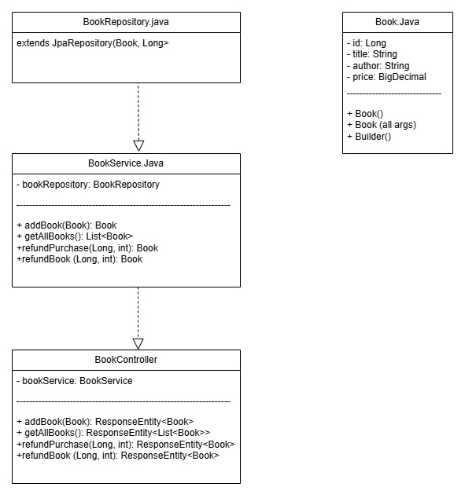

# INTRODUCTION

## Goals:

- Create a backend system for managing bookstore operations
- Implement endpoints for:
    - book management
    - purchase processing
    - refunds

# BACKGROUND

- CFG Masters+ Java group project
- Showcase knowledge in Java, Spring Boot, Lombok, TDD and deployments

# SPECIFICATIONS AND DESIGN

## Requirements:

### Technical:

- RESTful API endpoints to:
    - `POST/ add books`
    - `GET/ retrieve books`
    - `PATCH/ purchase books`
    - `PATCH/ refund books`
- Relational database to persist book and transaction data

### Nontechnical:

- User-friendly API documentation using Swagger/OpenAPI UI.
- Maintainability and readability of code.

## Design and Architecture:

- Architecture diagram (Controller → Service → Repository)
- Design pattern: Model-View-Controller (MVC)
- How endpoints interact with database and other components.

  

## Tools and Libraries:

- Spring Boot modules: Web, Data JPA
- JUnit
- Lombok
- MySQL Workbench
- Postman/Insomnia for API testing.
- Git/GitHub for version control and collaboration

# TESTING AND EVALUATION

## Unit Testing

- Use JUnit and Mockito to test services and controllers in isolation
- Mock external dependencies (e.g., repositories)
- SpringBootTest
- MockMvc

## Functional Testing

- End-to-end user flow simulations:
    - Adding a book and verifying it appears in inventory
    - Simulating a full purchase and refund cycle

## Edge case handling:

- Attempt to purchase out-of-stock books
- Attempt refunds for invalid transactions
- Attempt adding a book priced at boundary value

## Manual Test Plan

| Test Case                         | Endpoint                                                        | Description                                                  | Input Example                                                                                                                                      | Expected Outcome                                           |
|----------------------------------|------------------------------------------------------------------|--------------------------------------------------------------|----------------------------------------------------------------------------------------------------------------------------------------------------|------------------------------------------------------------|
| 1. Add a Valid Book              | `POST /books`                                                   | Add a new valid book to the store                            | `{ "title": "The Psychology of Money", "author": "Morgan Housel", "price": 10.99, "copiesAvailable": 8 }`                                          | 200 OK - Book is added                                    |
| 2. Add Book Below Price Limit    | `POST /books`                                                   | Try to add a book priced below the minimum limit (£1)        | `{ "title": "The Psychology of Money", "author": "Morgan Housel", "price": 0.99, "copiesAvailable": 8 }`                                           | 400 Bad Request                                           |
| 3. Add Book at Price Boundary    | `POST /books`                                                   | Add a book priced exactly at the boundary limit (£1)         | `{ "title": "The Psychology of Money", "author": "Morgan Housel", "price": 1.00, "copiesAvailable": 8 }`                                           | 200 OK - Book is added                                    |
| 4. Get All Books                 | `GET /books`                                                    | Retrieve a list of all available books                       | _None_                                                                                                                                             | 200 OK - JSON array of books                              |
| 5. Purchase a Book               | `PATCH /books/{id}/purchase?purchaseQuantity={quantity}`       | Simulate a book purchase (reduces stock count)               | Path: `/books/1/purchase`, Query: `purchaseQuantity=2`                                                                                             | 200 OK - Book copies reduced                              |
| 6. Refund a Book                 | `PATCH /books/{id}/refund?refundQuantity={quantity}`           | Simulate a book refund (increases stock count)               | Path: `/books/1/refund`, Query: `refundQuantity=1`                                                                                                 | 200 OK - Book copies increased           

## Demo of Endpoints
Watch the full demo of all REST API endpoints being tested using **Insomnia**
[Watch the video](documentation/endpoints-insomnia.mp4)

## OpenAPI
1. Ensure the ProjectApplication is running and then access the url here: http://localhost:8080/swagger-ui/index.html
2. Expand the endpoint dropdowns
3. Click on the Try it out buttons and Execute

# Deployment Instructions
- Docker Setup This project includes Docker-based deployment. 
- Below are the steps to build and run the application using Docker:

## Prerequisites
- Docker installed
- Docker Compose installed

## Build the Docker Image
bash
```
docker build -t cfg-java-masters-project
```

Run with Docker Compose:
```
docker-compose up
```

## Files Included
- Dockerfile: Builds the Spring Boot application. 
- docker-compose.yml: Defines services for the app and MySQL. 

### Deployment Pipeline (Proposal)
Outlines stages from code development to deployment.

1. Commit all code - push all updated code to GitHub
2. Automated Build - compile and build
```mvn clean install```
3. Run Automated Tests 
```./mvnw test```
4. Docker Image Build
```
docker build -t cfg-java-masters-project .
```
5. Docker Compose 
```
docker-compose up
```
6. Manually Verify Endpoints - Insomnia on local machine or Postman 
7. CI/CD Integration - Integrate with tools like Github Actions / Jenkins